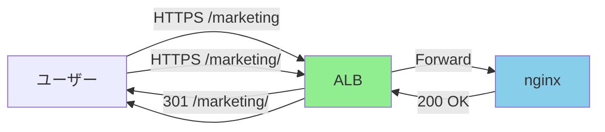

# URL正規化とリダイレクト設定 - エグゼクティブサマリー

**作成日**: 2026-03-13
**対象**: nxp.nyle.co.jp
**ステータス**: 🔴 **緊急対応が必要**

---

## TL;DR（要約）

nxp.nyle.co.jpのURL正規化設定において、**HTTPS→HTTP→HTTPSの二重リダイレクトチェーン**が発生しており、パフォーマンスとSEOに悪影響を与えています。設定が4箇所に分散し、管理が複雑化しています。

**推奨アクション**: nginxからtrailing slash正規化を削除し、ALBに統合することで、リダイレクトを1回に削減。

**期待効果**:
- パフォーマンス: 150-250ms高速化
- SEO: リダイレクトチェーン解消によるクロール効率向上
- 保守性: 設定ファイル数を6→2に削減

---

## 問題の概要

### 1. 重大な問題: 二重リダイレクトチェーン

**現状**:
```
ユーザー: https://nxp.nyle.co.jp/marketing
  ↓
nginx: 301 → http://nxp.nyle.co.jp/marketing/  ← ❌ HTTPにダウングレード
  ↓
ALB:   301 → https://nxp.nyle.co.jp/marketing/ ← ❌ 再度HTTPSにアップグレード
  ↓
nginx: 200 OK
```

**影響**:
- 200-500msのレスポンス遅延
- Googleクローラーの効率低下
- サーバーリソースの無駄な消費
- AWS ALBコスト増加（約3倍の処理）

### 2. 設定の分散

リダイレクト設定が**4箇所**に散在:
1. ALB Rules（優先度81-90）
2. nginx `10-nxp-prod.conf`（本番）
3. nginx `nxp.conf`（未使用？）
4. CloudFront Function（未使用？）
5. HTML meta refresh（バックアップ？）

**リスク**: 同じリダイレクトが複数箇所で重複定義され、変更時の漏れが発生しやすい

### 3. SEO問題

- 301 Permanent Redirectと302 Temporary Redirectが混在
- リダイレクトチェーンが2回以上（Googleの推奨に反する）
- PageRankの伝達が不完全

---

## 推奨ソリューション

### アーキテクチャ変更

**現状**: ALB + nginxで二重リダイレクト
**改善後**: ALBでリダイレクト、nginxはSPAルーティングのみ



### 実装ステップ（3フェーズ）

#### Phase 1: 緊急対応（即時）
- nginxからtrailing slash正規化を削除
- ALBにtrailing slash正規化ルールを追加
- **所要時間**: 1-2時間
- **効果**: 二重リダイレクト解消

#### Phase 2: 設定整理（1週間以内）
- 未使用ファイルの削除
- ドキュメント作成
- **所要時間**: 2-3時間
- **効果**: 保守性向上

#### Phase 3: 最適化（1ヶ月以内）
- ALBルールの最適化
- IaC導入検討
- **所要時間**: 1日
- **効果**: 長期的な管理効率化

---

## ビジネスインパクト

### パフォーマンス改善

| 指標 | 現状 | 改善後 | 効果 |
|-----|------|--------|------|
| リダイレクト回数 | 2回 | 1回 | **50%削減** |
| レスポンス時間 | 300-500ms | 100-150ms | **150-250ms高速化** |
| ALB処理コスト | 3リクエスト/アクセス | 1リクエスト/アクセス | **約67%削減** |

### SEO効果

- **クロール効率**: Googlebotがリダイレクトチェーンで諦めるリスクを排除
- **PageRank伝達**: 301統一によりSEO評価を適切に継承
- **インデックス速度**: リダイレクト削減により新規ページのインデックスが高速化

### 保守性向上

| 項目 | 現状 | 改善後 |
|-----|------|--------|
| 設定ファイル数 | 6ファイル | 2ファイル（ALB + nginx） |
| リダイレクト定義箇所 | 5箇所 | 1箇所（ALB） |
| 変更時の確認箇所 | 4-5箇所 | 1-2箇所 |

---

## リスク評価

| リスク | 発生確率 | 影響度 | 軽減策 |
|-------|---------|--------|--------|
| 二重リダイレクト再発 | 低 | 中 | 自動テスト導入 |
| ALB設定ミス | 中 | 高 | ステージング検証、IaC化 |
| SEO順位一時低下 | 低 | 中 | 301使用、監視強化 |
| ユーザーアクセス不可 | 低 | 高 | 段階的リリース |

**総合リスク評価**: **低〜中**（適切な手順で実施すれば安全）

---

## 推奨アクション（優先度順）

### 🔴 高優先度（即時実施）

1. **Phase 1の実施**
   - nginxからtrailing slash正規化を削除
   - ALBに正規化ルールを追加
   - 動作確認テスト
   - **担当**: インフラチーム
   - **期限**: 即時〜1週間以内

### 🟡 中優先度（1週間以内）

2. **Phase 2の実施**
   - 未使用ファイルの削除
   - ドキュメント作成
   - **担当**: 開発チーム
   - **期限**: 1週間以内

### 🟢 低優先度（1ヶ月以内）

3. **Phase 3の実施**
   - ALBルールの最適化
   - IaC導入
   - 監視強化
   - **担当**: インフラ・DevOpsチーム
   - **期限**: 1ヶ月以内

---

## 成功指標（KPI）

### 短期（Phase 1完了後）
- [ ] `/marketing`アクセス時のリダイレクト回数: 2回 → **1回**
- [ ] TTFB: 300-500ms → **100-200ms**
- [ ] 全URLパターンで正常動作

### 中期（Phase 2完了後）
- [ ] 設定ファイル数: 6 → **2**
- [ ] ドキュメントカバレッジ: 0% → **100%**
- [ ] コードレビューでの指摘事項: 削減

### 長期（Phase 3完了後）
- [ ] Lighthouse Performance Score: **+5点以上**
- [ ] Google Search Console: クロールエラー **0件**
- [ ] インフラ変更リードタイム: **50%短縮**（IaCにより）

---

## 次のステップ

1. **このサマリーをステークホルダーに共有**
   - 経営層、マーケティング、開発、インフラチーム

2. **Phase 1の実施承認を取得**
   - リスクが低く、効果が大きいため即時実施を推奨

3. **実装チームのアサイン**
   - インフラエンジニア（ALB設定）
   - バックエンドエンジニア（nginx設定）
   - QAエンジニア（テスト）

4. **詳細実装ガイドの確認**
   - `docs/analysis/redirect-implementation-guide.md`

---

## 詳細ドキュメント

- **包括的分析レポート**: [`url-normalization-redirect-analysis.md`](./url-normalization-redirect-analysis.md)
- **実装ガイド**: [`redirect-implementation-guide.md`](./redirect-implementation-guide.md)

---

## Q&A

### Q1: この変更で既存ユーザーに影響は？
**A**: ユーザーへの影響はありません。むしろページ読み込みが高速化します。

### Q2: デプロイ時のダウンタイムは？
**A**: ゼロダウンタイムで実施可能です。nginxはreload、ALBは即座に反映されます。

### Q3: ロールバックは可能？
**A**: 可能です。nginxはgit revert、ALBはルール削除で即座にロールバック可能です。

### Q4: 他の環境（開発、ステージング）も対象？
**A**: はい。開発環境（dev.nxp.nyle.co.jp）も同様の問題があり、同時に修正します。

### Q5: コストへの影響は？
**A**: AWS ALBコストが削減されます（処理回数が約67%減少）。具体的な金額は月間トラフィックに依存しますが、数千円〜数万円の削減が見込まれます。

---

**承認者サイン欄**

- [ ] インフラ責任者: ________________ 日付: ________
- [ ] 開発責任者: ________________ 日付: ________
- [ ] マーケティング責任者: ________________ 日付: ________

---

**エグゼクティブサマリー終了**
