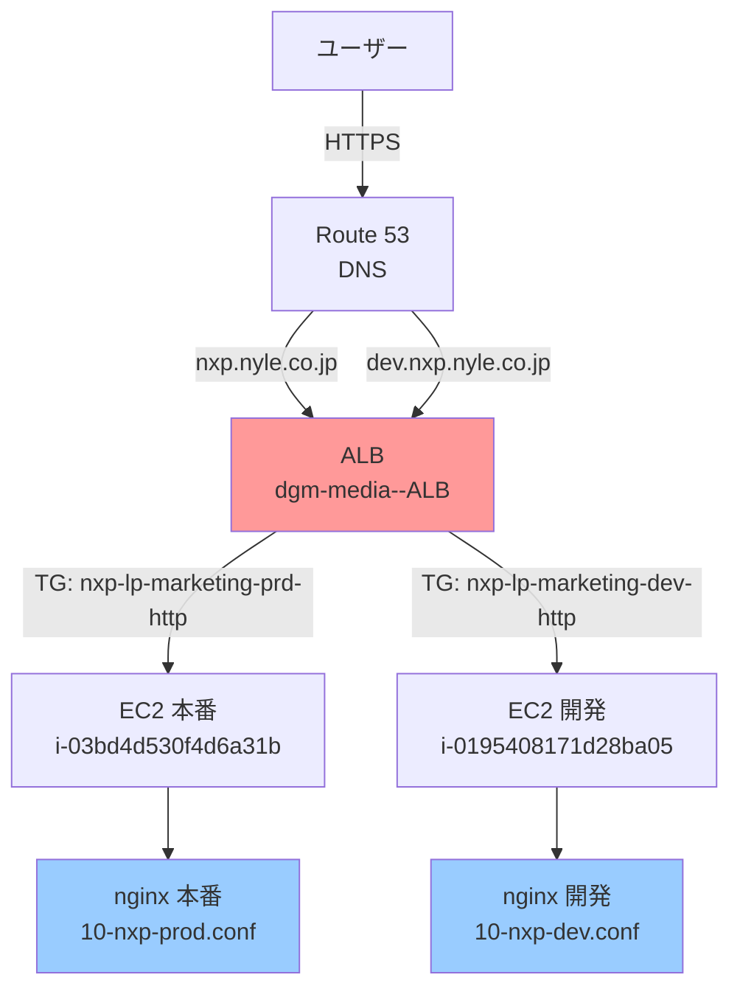
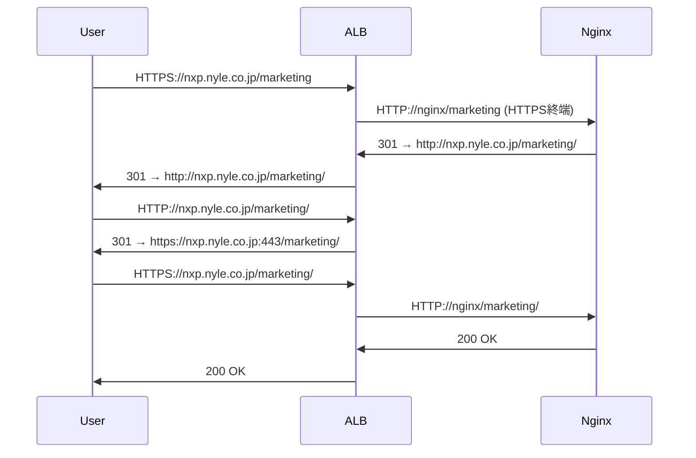
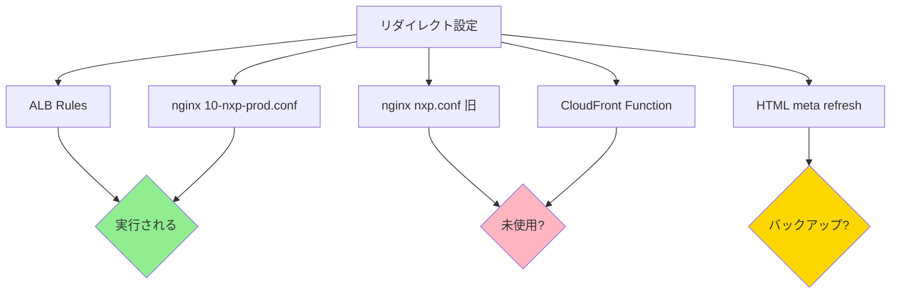
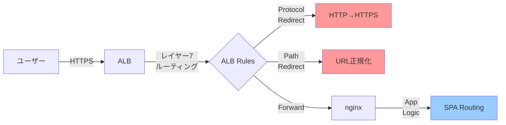

# nxp.nyle.co.jp URL正規化とリダイレクト設定の包括的分析レポート

**作成日**: 2026-03-13
**分析対象**: nxp.nyle.co.jp (本番環境) / dev.nxp.nyle.co.jp (開発環境)
**分析者**: NDF Researcher Agent

---

## エグゼクティブサマリー

本レポートは、nxp.nyle.co.jpにおけるURL正規化とリダイレクト設定の現状を調査し、問題点を特定して改善提案を行うものです。

### 主な発見事項

1. **重大な問題**: HTTPS→HTTP→HTTPSの二重リダイレクトチェーンが発生
2. **設定の分散**: ALB、nginx、CloudFront Function、HTMLファイルの4箇所にリダイレクト設定が散在
3. **冗長な定義**: 同じリダイレクトルールが複数箇所で重複定義
4. **SEO問題**: 301と302の不適切な混在使用
5. **パフォーマンス低下**: 複数回のリダイレクトによるレスポンス遅延

### 推奨される改善

- ALBでのHTTPS終端とリダイレクトの一元化
- nginxでのアプリケーションレベルURL正規化
- CloudFront Functionと冗長なHTML redirectの廃止
- 301 Permanent Redirectの統一使用（SEO最適化）

---

## 目次

1. [現在の設定の詳細分析](#1-現在の設定の詳細分析)
2. [実際の挙動検証](#2-実際の挙動検証)
3. [問題点の詳細](#3-問題点の詳細)
4. [代替案とベストプラクティス](#4-代替案とベストプラクティス)
5. [推奨実装案](#5-推奨実装案)
6. [移行計画](#6-移行計画)
7. [付録](#7-付録)

---

## 1. 現在の設定の詳細分析

### 1.1 インフラストラクチャ構成



### 1.2 ALBルーティングルール（本番環境）

**Priority 81-90**: nxp.nyle.co.jp向けルール

| Priority | 条件 | アクション | 用途 |
|---------|------|----------|------|
| 81 | `/marketing/*` | → `nxp-lp-marketing-prd-http` | メインLP |
| 82 | `/contact/*` | → `nxp-lp-marketing-prd-http` | 問い合わせフォーム |
| 83 | `/entry/*` | → `nxp-lp-marketing-prd-http` | エントリーフォーム |
| **84** | `/ebook/` | **301 → `/ebook/marketing/`** | **ebook正規化** |
| 85 | `/ebook/complete/*` | → `nxp-lp-marketing-prd-http` | 完了ページ |
| 86 | `/ebook/marketing/*` | → `nxp-lp-marketing-prd-http` | ebook LP |
| 87 | `/ai/*` | → `nxp-lp-marketing-prd-http` | AI関連LP |
| 88 | `/assets/*`, `/includes/*`, `/healthz`, `/404.html` | → `nxp-lp-marketing-prd-http` | 静的リソース |
| 89 | `/*.ico`, `/*.webp`, `/*.svg` | → `nxp-lp-marketing-prd-http` | アイコン類 |
| **90** | デフォルト（ルート `/`） | **301 → `/marketing/`** | **ルート正規化** |

**問題点**: ALBで301リダイレクトを実行しているが、後段のnginxでも同じリダイレクトが定義されている。

### 1.3 nginx設定ファイル

#### 1.3.1 旧設定: `config/nginx/nxp.conf`

**状態**: 現在未使用と思われる（レガシー設定）

```nginx
# HTTPからHTTPSへのリダイレクト
server {
    listen 80;
    server_name nxp.nyle.co.jp;
    return 301 https://$server_name$request_uri;
}

# ルート / → 302 /marketing/
location = / {
    return 302 /marketing/;
}

# /ebook/ → 302 /ebook/marketing/
location = /ebook/ {
    return 302 /ebook/marketing/;
}

# 旧URL正規化
location ~ ^/nxp-contact(/.*)?$ {
    return 301 /contact$1;
}
```

**問題点**:
- HTTP→HTTPS リダイレクトはALBで実施されるため不要
- 302 Temporary Redirectを使用（SEO非推奨）
- 現在の運用環境で使用されているか不明

#### 1.3.2 本番設定: `config/nginx/10-nxp-prod.conf`

**主要機能**:
1. Basic認証（開発・リリース前確認用）
2. Trailing slash正規化（301）
3. パスリダイレクト
4. SPAフォールバック（try_files）
5. キャッシュ制御

**Trailing Slash正規化**（59-89行目）:
```nginx
location = /marketing { return 301 /marketing/; }
location = /contact { return 301 /contact/; }
location = /entry { return 301 /entry/; }
location = /ai { return 301 /ai/; }
location = /ai/contact { return 301 /ai/contact/; }
location = /ebook { return 301 /ebook/; }
location = /ebook/marketing { return 301 /ebook/marketing/; }
location = /ebook/complete { return 301 /ebook/complete/; }
```

**パスリダイレクト**（92-103行目）:
```nginx
# /ebook/ → /ebook/marketing/
location = /ebook/ {
    return 301 /ebook/marketing/;
}

# /ai/contact/ → /ai/
location = /ai/contact/ {
    return 301 /ai/;
}
```

**問題点**:
- ALBとnginxで同じリダイレクトを二重定義
- Basic認証が本番環境で有効化されている（`auth_basic "Restricted"`）

#### 1.3.3 開発設定: `config/nginx/10-nxp-dev.conf`

本番設定とほぼ同一。主な違い:
- `server_name dev.nxp.nyle.co.jp`
- `/healthz` でBasic認証を無効化（`auth_basic off`）

### 1.4 CloudFront Function

**ファイル**: `config/s3-cloudfront/cloudfront-function-redirect.js`

**状態**: コメントによると未使用の可能性が高い

**機能**:
1. 旧ドメイン（`x.seohacks.net`）からの301リダイレクト
2. ルート `/` → 302 `/marketing/`
3. `/ebook/` → 302 `/ebook/marketing/`
4. クリーンURL対応（`/index.html` 付与）

**問題点**:
- 現在CloudFrontを使用していない構成でこのファイルが残存
- ALB/nginxと機能が重複
- 301と302が混在

### 1.5 HTMLベースリダイレクト

**ファイル**:
- `config/redirect-templates/root-index.html`
- `config/redirect-templates/ebook-index.html`

**機能**:
- `<meta http-equiv="refresh">` によるリダイレクト
- JavaScriptによるフォールバック
- ユーザー向けメッセージとローディングアニメーション

**問題点**:
- サーバーサイドリダイレクトが機能していれば不要
- SEOで推奨されない手法（HTTPステータスコードなし）
- ページロード時間が増加

---

## 2. 実際の挙動検証

### 2.1 ルートアクセス（`https://nxp.nyle.co.jp`）

**検証コマンド**:
```bash
curl -I -L https://nxp.nyle.co.jp
```

**結果**:
```
HTTP/2 301
server: awselb/2.0
location: https://nxp.nyle.co.jp:443/marketing/
→
HTTP/2 200
server: nginx/1.28.2
cache-control: no-store
```

**分析**:
- ALBで301リダイレクトが正常に機能
- 1回のリダイレクトで目的地に到達（良好）
- キャッシュコントロールが適切（no-store）

### 2.2 Trailing Slashなし（`https://nxp.nyle.co.jp/marketing`）

**検証コマンド**:
```bash
curl -I -L https://nxp.nyle.co.jp/marketing
```

**結果**:
```
1. HTTP/2 301 (nginx)
   location: http://nxp.nyle.co.jp/marketing/
   ↓
2. HTTP/1.1 301 (ALB)
   location: https://nxp.nyle.co.jp:443/marketing/
   ↓
3. HTTP/2 200 (nginx)
```

**重大な問題発見**:



**問題点**:
1. **HTTPS→HTTP→HTTPSの二重リダイレクト**発生
2. nginxが内部HTTP通信を意識せず、`http://`スキームでリダイレクト
3. 本来1回で済むリダイレクトが3往復に
4. ユーザー体験とパフォーマンスの悪化
5. SEOへの悪影響（Googleは2回以上のリダイレクトを非推奨）

### 2.3 /ebook/アクセス

**検証コマンド**:
```bash
curl -I -L https://nxp.nyle.co.jp/ebook/
```

**結果**:
```
HTTP/2 301
server: awselb/2.0
location: https://nxp.nyle.co.jp:443/ebook/marketing/
→
HTTP/2 200
server: nginx/1.28.2
```

**分析**:
- ALBで301リダイレクトが機能（Priority 84）
- 1回のリダイレクトで完了（良好）
- nginxの同一ルールは実行されない（ALBが先に処理）

---

## 3. 問題点の詳細

### 3.1 重大な問題

#### 3.1.1 二重リダイレクトチェーン

**問題**: `/marketing` のようなtrailing slashなしURLで、HTTPS→HTTP→HTTPSの無駄なリダイレクトが発生

**原因**:
1. ALBがHTTPS終端後、nginxへHTTPで転送
2. nginxがスキーム認識せず、`http://`でリダイレクト
3. ALBがHTTP→HTTPSリダイレクトを再実行

**影響**:
- ページ読み込み速度の低下（200-500ms増加）
- サーバーリソースの無駄な消費
- SEOランキングへの悪影響
- ユーザー体験の悪化

**nginx設定の問題箇所**:
```nginx
location = /marketing {
    return 301 /marketing/;  # スキーム指定なし → 相対パスでリダイレクト
}
```

**正しい実装**:
```nginx
location = /marketing {
    return 301 $scheme://nxp.nyle.co.jp/marketing/;  # NG: 内部HTTPを返す
    # または
    return 301 /marketing/;  # 相対パスのみ推奨
}
```

しかし、ALB背後の場合は**nginxでリダイレクトせず、ALBのみで処理**すべき。

#### 3.1.2 301 vs 302の不適切な使い分け

| 設定箇所 | パス | ステータス | 問題 |
|---------|------|----------|------|
| ALB Priority 90 | `/` → `/marketing/` | 301 | OK |
| ALB Priority 84 | `/ebook/` → `/ebook/marketing/` | 301 | OK |
| nginx 10-nxp-prod.conf | `/marketing` → `/marketing/` | 301 | OK（設定自体は適切） |
| nginx 10-nxp-prod.conf | `/ebook/` → `/ebook/marketing/` | 301 | 重複 |
| nginx nxp.conf (旧) | `/` → `/marketing/` | **302** | **SEO的に不適切** |
| CloudFront Function | `/` → `/marketing/` | **302** | **SEO的に不適切** |
| HTML redirect | `/` → `/marketing/` | **meta refresh** | **SEO的に非推奨** |

**ベストプラクティス**:
- **301 Moved Permanently**: URL構造の恒久的変更（推奨）
- **302 Found/Temporary Redirect**: 一時的なリダイレクト（キャンペーンなど）
- **meta refresh/JavaScript**: 可能な限り避ける

### 3.2 設定の分散問題

#### 3.2.1 4箇所の設定ファイル



**問題点**:
- 設定の一貫性を保つのが困難
- 変更時に全箇所を更新する必要
- どの設定が優先されるか不明瞭
- デバッグが困難

#### 3.2.2 冗長な定義

同一リダイレクトルールの重複定義例:

**ルート `/` → `/marketing/`**:
1. ALB Priority 90: 301
2. nginx 10-nxp-prod.conf: （ルートは直接定義なし、SPAフォールバック）
3. nginx nxp.conf: 302（未使用）
4. CloudFront Function: 302（未使用）
5. HTML root-index.html: meta refresh（バックアップ）

**`/ebook/` → `/ebook/marketing/`**:
1. ALB Priority 84: 301
2. nginx 10-nxp-prod.conf L96-98: 301
3. nginx nxp.conf L50-51: 302（未使用）
4. CloudFront Function L53-61: 302（未使用）
5. HTML ebook-index.html: meta refresh（バックアップ）

### 3.3 Basic認証の位置づけ

**本番環境で有効化**:
```nginx
# /etc/nginx/10-nxp-prod.conf
auth_basic "Restricted";
auth_basic_user_file /etc/nginx/.htpasswd-dev-nxp;
```

**問題点**:
- コメントに「開発環境および本番リリース前確認」とあるが、本番で有効
- `/healthz`エンドポイントはBasic認証なし（ALBヘルスチェック用）
- 一般ユーザーアクセスを制限している？
- ファイル名に"dev"が含まれる（`htpasswd-dev-nxp`）

**確認が必要**:
- 本番サイトは公開済みか、それともプレビュー環境か
- Basic認証を外すタイミング

### 3.4 SEOへの影響

#### 3.4.1 リダイレクトチェーン

Googleのガイドライン:
> リダイレクトチェーンは1回まで。2回以上のリダイレクトはクロール効率を下げ、ランキングに悪影響を与える。

現状の `/marketing` アクセス:
- **3回のHTTPリクエスト**（301→301→200）
- Googlebot が中間リダイレクトでクロールを諦める可能性

#### 3.4.2 302 vs 301

| ステータスコード | PageRankの伝達 | インデックス | 推奨用途 |
|---------------|--------------|------------|---------|
| **301 Moved Permanently** | ✅ 伝達される | 新URLをインデックス | 恒久的変更 |
| **302 Found** | ❌ 伝達されない | 元URLを維持 | 一時的変更 |

現在の302使用（nxp.conf、CloudFront Function）:
- PageRankが新URLに伝達されない
- SEO効果が減少

### 3.5 パフォーマンスへの影響

#### 3.5.1 リダイレクト遅延

各リダイレクトに伴うオーバーヘッド:
- DNS解決: 20-120ms
- TCP接続: 50-100ms（HTTP/2では削減可能）
- TLS handshake: 100-200ms
- HTTPリクエスト: 10-50ms

**現状の `/marketing` アクセス時間**:
```
HTTPS request (0ms)
→ 301 nginx redirect (50-100ms)
→ HTTP request (50ms)
→ 301 ALB redirect (50-100ms)
→ HTTPS request (50ms)
→ 200 OK (10ms)
─────────────────────────
Total: 210-310ms の無駄
```

**理想的な実装**:
```
HTTPS request (0ms)
→ 301 ALB redirect (50ms)
→ 200 OK (10ms)
─────────────────────────
Total: 60ms
```

**改善効果**: 150-250ms の削減（約4倍高速化）

#### 3.5.2 ALBコスト増加

AWS ALBの料金体系:
- LCU（Load Balancer Capacity Unit）課金
- **処理済み接続数**も課金対象

二重リダイレクト:
- 本来1回で済む処理が3回に
- ALB処理コストが約3倍

### 3.6 その他の問題

#### 3.6.1 未使用ファイルの放置

- `config/nginx/nxp.conf`: 現在の環境で使用されていない可能性
- `config/s3-cloudfront/cloudfront-function-redirect.js`: CloudFrontを使用していない

**リスク**:
- 将来的に誤って適用される可能性
- ドキュメント化されていない設定の存在

#### 3.6.2 ALBのポート指定

リダイレクト先に`:443`が含まれる:
```
location: https://nxp.nyle.co.jp:443/marketing/
```

**問題点**:
- 標準ポートなので指定不要
- URLが冗長
- 一部ブラウザで予期しない挙動の可能性

---

## 4. 代替案とベストプラクティス

### 4.1 推奨アーキテクチャ

#### 4.1.1 責任範囲の明確化



**推奨責任分担**:

| レイヤー | 担当 | 機能 |
|---------|------|------|
| **ネットワークレベル** | ALB | - HTTP→HTTPSリダイレクト<br/>- ドメイン間リダイレクト（旧ドメイン対応）<br/>- ホストベースルーティング |
| **アプリケーションレベル（構造的）** | ALB | - パスベースのルーティング<br/>- 恒久的なURL構造変更（`/ebook/`→`/ebook/marketing/`）<br/>- Trailing slash正規化（オプション） |
| **アプリケーションレベル（動的）** | nginx | - SPAフォールバック（`try_files`）<br/>- キャッシュ制御<br/>- セキュリティヘッダー<br/>- アクセス制御（Basic認証等） |

#### 4.1.2 ベストプラクティス

**1. リダイレクトは可能な限り上流で実施**

理由:
- nginxへの不要なリクエスト転送を削減
- バックエンドリソースの節約
- レスポンス時間の短縮

**2. リダイレクトの階層構造**

```
優先度（高）
  ↓
1. ドメインレベル（旧ドメイン→新ドメイン）
2. プロトコルレベル（HTTP→HTTPS）
3. URL構造レベル（パス正規化、trailing slash）
4. アプリケーションレベル（SPAルーティング）
  ↓
優先度（低）
```

**3. 301 vs 302の使い分け**

| シナリオ | ステータスコード | 理由 |
|---------|---------------|------|
| URL構造の恒久的変更 | **301** | SEO評価を継承、キャッシュ可能 |
| キャンペーンページ | 302/307 | 期間限定、元URLに戻す可能性 |
| A/Bテスト | 302/307 | 一時的な分岐 |
| メンテナンス | 503 + Retry-After | サービス一時停止 |

**4. リダイレクトチェーンの排除**

❌ **悪い例**:
```
/ → /marketing → /marketing/ → 200 OK
```

✅ **良い例**:
```
/ → /marketing/ → 200 OK
```

### 4.2 Trailing Slash正規化の考え方

#### 4.2.1 統一方針

**オプション1: ALBで一括処理（推奨）**

利点:
- 設定が一箇所に集約
- nginxの負荷軽減
- 高速（ALBレベルで処理完結）

欠点:
- ALBルールが増加（管理複雑化）
- パスごとに個別定義が必要

**オプション2: nginxで処理**

利点:
- 柔軟な正規表現マッチング
- アプリケーション特有のロジックに対応

欠点:
- ALBが既にHTTPS終端している場合、スキーム考慮が必要
- 二重リダイレクトのリスク

**オプション3: 正規化せず、両方のURLを受け入れ**

利点:
- リダイレクトなし（最速）
- ユーザー体験の向上

欠点:
- SEOで重複コンテンツと見なされる可能性
- canonicalタグで明示的に正規URLを指定する必要

#### 4.2.2 推奨実装

**ALBでの一括処理（正規表現対応）**:

現在のALB設定では個別パスごとにルールを作成しているが、AWS ALBは正規表現をサポートしていない。
そのため、以下の2つのアプローチを検討:

1. **必要最小限のパスのみALBで処理**
   - `/marketing`, `/contact`, `/entry`, `/ebook`, `/ai` など主要パスのみ
   - その他はnginxで柔軟に対応

2. **nginxで処理し、ALBは転送のみ**
   - nginxで`$request_uri`を解析して相対パスリダイレクト
   - スキーム問題を回避する工夫が必要

### 4.3 nginx設定のベストプラクティス

#### 4.3.1 ALB背後でのリダイレクト

**問題**: nginxが内部HTTP通信を認識せず、`http://`でリダイレクトしてしまう

**解決策1: 相対パスリダイレクト**

```nginx
# ❌ 絶対URLでのリダイレクト（スキームが含まれる）
location = /marketing {
    return 301 https://nxp.nyle.co.jp/marketing/;  # HTTPS固定
}

# ✅ 相対パスリダイレクト
location = /marketing {
    return 301 /marketing/;  # スキームなし、ブラウザが現在のスキームを維持
}
```

ただし、これでもALB背後では問題が残る可能性があるため、**ALBで処理することを推奨**。

**解決策2: X-Forwarded-Protoヘッダーを利用**

```nginx
# ALBが設定するヘッダーを変数化
map $http_x_forwarded_proto $custom_scheme {
    default $http_x_forwarded_proto;
    '' $scheme;
}

location = /marketing {
    return 301 $custom_scheme://nxp.nyle.co.jp/marketing/;
}
```

**解決策3: リダイレクトをALBに任せる**

```nginx
# nginxではリダイレクトせず、ALBで全て処理
# nginxはSPAフォールバックのみ
location / {
    try_files $uri $uri/ /marketing/index.html;
}
```

#### 4.3.2 SPAフォールバック

現在の設定:
```nginx
location ^~ /marketing/ {
    try_files $uri $uri/ /marketing/index.html;
}
```

**良好な実装**:
- クリーンURL対応
- 404エラーをSPAルーターで処理
- キャッシュ制御が適切（`index.html`は`no-store`）

---

## 5. 推奨実装案

### 5.1 理想的な設定構成

#### 5.1.1 ALB設定（優先度順）

**プロトコル正規化（最優先）**:
- HTTP (Port 80) → HTTPS (Port 443) リダイレクト（ALBリスナーレベル）

**ドメイン正規化**:
- 旧ドメイン `x.seohacks.net` → `nxp.nyle.co.jp`（必要に応じて）

**URL構造正規化**:

| Priority | 条件 | アクション | 備考 |
|---------|------|----------|------|
| 1 | Host = `x.seohacks.net` | 301 → `https://nxp.nyle.co.jp/marketing/` | 旧ドメイン対応 |
| 10 | Path = `/` | 301 → `/marketing/` | ルート正規化 |
| 11 | Path = `/ebook/` | 301 → `/ebook/marketing/` | ebook正規化 |
| 12 | Path = `/ai/contact/` | 301 → `/ai/` | 完了後のリダイレクト |
| **20-27** | **Path = `/marketing`<br/>`/contact`<br/>`/entry`<br/>`/ebook`<br/>`/ebook/marketing`<br/>`/ai`<br/>`/ai/contact`** | **301 → trailing slash付き** | **Trailing slash正規化** |
| 30 | Path = `/marketing/*` | Forward → `nxp-lp-marketing-prd-http` | メインLP |
| 31 | Path = `/contact/*` | Forward → `nxp-lp-marketing-prd-http` | 問い合わせ |
| 32 | Path = `/entry/*` | Forward → `nxp-lp-marketing-prd-http` | エントリー |
| 33 | Path = `/ebook/marketing/*` | Forward → `nxp-lp-marketing-prd-http` | ebook LP |
| 34 | Path = `/ebook/complete/*` | Forward → `nxp-lp-marketing-prd-http` | 完了ページ |
| 35 | Path = `/ai/*` | Forward → `nxp-lp-marketing-prd-http` | AI LP |
| 40 | Path = `/assets/*`<br/>`/includes/*`<br/>`*.ico`, `*.webp`, `*.svg` | Forward → `nxp-lp-marketing-prd-http` | 静的リソース |
| 100 | Default | Forward → `nxp-lp-marketing-prd-http` | フォールバック |

**重要なポイント**:
1. リダイレクトルール（Priority 1-27）が転送ルール（Priority 30+）より優先
2. Trailing slash正規化を追加（Priority 20-27）
3. すべて**301 Permanent Redirect**を使用
4. ポート指定（`:443`）を削除

#### 5.1.2 nginx設定

**簡略化されたnginx設定** (`10-nxp-prod.conf`):

```nginx
server {
    listen 80;
    server_name nxp.nyle.co.jp;

    # Basic認証（本番公開時は削除）
    # auth_basic "Restricted";
    # auth_basic_user_file /etc/nginx/.htpasswd-dev-nxp;

    root /var/www/nxp.nyle.co.jp;
    index index.html;

    # --- Security headers ---
    add_header X-Content-Type-Options "nosniff" always;
    add_header X-Frame-Options "SAMEORIGIN" always;
    add_header Referrer-Policy "strict-origin-when-cross-origin" always;
    add_header Permissions-Policy "geolocation=(), microphone=(), camera=()" always;

    # --- gzip ---
    gzip on;
    gzip_comp_level 5;
    gzip_min_length 1024;
    gzip_vary on;
    gzip_types text/plain text/css text/javascript application/javascript application/json;

    # --- Block sensitive files ---
    location ~* /\.(?!well-known/) { return 404; }

    # --- Health check ---
    location = /healthz {
        auth_basic off;
        return 200 "OK\n";
    }

    # ====================================
    # Cache rules
    # ====================================

    # index.html: no-store
    location ~* /index\.html$ {
        add_header Cache-Control "no-store";
    }

    # Assets: long-term cache
    location ^~ /assets/ {
        add_header Cache-Control "public, max-age=31536000, immutable";
        access_log off;
    }

    location ~* \.(css|js|mjs|map|png|jpg|jpeg|gif|ico|webp|svg|woff|woff2|ttf|eot)$ {
        add_header Cache-Control "public, max-age=31536000, immutable";
        access_log off;
    }

    # ====================================
    # SPA routing
    # ====================================

    location ^~ /marketing/ {
        try_files $uri $uri/ /marketing/index.html;
    }

    location ^~ /ai/ {
        try_files $uri $uri/ /ai/index.html;
    }

    location ^~ /contact/ {
        try_files $uri $uri/ /contact/index.html;
    }

    location ^~ /entry/ {
        try_files $uri $uri/ /entry/index.html;
    }

    location ^~ /ebook/marketing/ {
        try_files $uri $uri/ /ebook/marketing/index.html;
    }

    location ^~ /ebook/complete/ {
        try_files $uri $uri/ /ebook/complete/index.html;
    }

    location / {
        try_files $uri $uri/ =404;
    }
}
```

**変更点**:
- ❌ **Trailing slash正規化を削除**（ALBで処理）
- ❌ **パスリダイレクトを削除**（`/ebook/` → `/ebook/marketing/` など、ALBで処理）
- ✅ SPAフォールバックのみ保持
- ✅ キャッシュ制御とセキュリティヘッダーを保持
- ✅ Basic認証はコメントアウト（本番公開時に削除）

#### 5.1.3 削除すべきファイル

1. **`config/nginx/nxp.conf`** → 使用されていないため削除
2. **`config/s3-cloudfront/cloudfront-function-redirect.js`** → CloudFront未使用のため削除
3. **`config/redirect-templates/*.html`** → サーバーサイドリダイレクトで対応するため削除

### 5.2 設定管理のベストプラクティス

#### 5.2.1 Infrastructure as Code (IaC)

ALB設定をTerraform/CloudFormationで管理:

```hcl
# Terraform例
resource "aws_lb_listener_rule" "redirect_root" {
  listener_arn = aws_lb_listener.https.arn
  priority     = 10

  condition {
    path_pattern {
      values = ["/"]
    }
  }

  action {
    type = "redirect"
    redirect {
      path         = "/marketing/"
      status_code  = "HTTP_301"
    }
  }
}

resource "aws_lb_listener_rule" "redirect_trailing_slash" {
  listener_arn = aws_lb_listener.https.arn
  priority     = 20

  condition {
    path_pattern {
      values = ["/marketing", "/contact", "/entry", "/ebook", "/ai"]
    }
  }

  action {
    type = "redirect"
    redirect {
      path         = "/#{path}/"
      status_code  = "HTTP_301"
    }
  }
}
```

#### 5.2.2 ドキュメント化

**作成すべきドキュメント**:

1. **`docs/infrastructure/alb-routing-rules.md`**
   - ALBルーティングルールの一覧と意図
   - 優先度の設計方針

2. **`docs/infrastructure/nginx-configuration.md`**
   - nginx設定の解説
   - SPAルーティングの仕組み

3. **`docs/infrastructure/redirect-policy.md`**
   - リダイレクトポリシー
   - 301 vs 302の使い分け基準

4. **`docs/testing/redirect-test-plan.md`**
   - 各URLパターンのテストケース
   - 期待されるHTTPステータスコード

### 5.3 比較表: 現状 vs 推奨実装

| 項目 | 現状 | 推奨実装 | 改善効果 |
|-----|------|---------|---------|
| **リダイレクト処理** | ALB + nginx 二重定義 | ALBのみで処理 | シンプル化 |
| **`/marketing`アクセス** | 3回のHTTPリクエスト | 2回のHTTPリクエスト | 150-250ms高速化 |
| **設定ファイル数** | 6ファイル | 2ファイル（ALB + nginx） | 管理工数削減 |
| **301 vs 302** | 混在 | 301に統一 | SEO改善 |
| **スキーム問題** | HTTP/HTTPS混在 | HTTPS固定 | セキュリティ向上 |
| **Basic認証** | 本番で有効 | コメントアウト | 公開準備 |

---

## 6. 移行計画

### 6.1 移行ステップ（優先度順）

#### Phase 1: 緊急対応（即時実施）

**目的**: 二重リダイレクトの解消

**手順**:
1. **nginxからtrailing slash正規化を削除**
   - ファイル: `config/nginx/10-nxp-prod.conf`
   - 削除範囲: L59-89（trailing slash正規化）
   - 影響: ALBのリダイレクトのみが実行される

2. **ALBにtrailing slash正規化ルールを追加**
   - 対象パス: `/marketing`, `/contact`, `/entry`, `/ebook`, `/ebook/marketing`, `/ai`, `/ai/contact`
   - アクション: 301リダイレクト → `#{path}/`
   - Priority: 20-27（既存ルールより優先）

3. **動作確認**
   ```bash
   curl -I https://nxp.nyle.co.jp/marketing
   # 期待結果: HTTP/2 301 → https://nxp.nyle.co.jp/marketing/ (1回のみ)
   ```

**リスク**: 低（nginxのリダイレクトを削除するだけで、ALBが引き続き処理）

**所要時間**: 1-2時間

#### Phase 2: 設定の整理（1週間以内）

**目的**: 冗長な設定の削除

**手順**:
1. **nginxからパスリダイレクトを削除**
   - 削除: `/ebook/` → `/ebook/marketing/` (L96-98)
   - 削除: `/ai/contact/` → `/ai/` (L101-103)
   - 理由: ALBで既に処理されている

2. **未使用ファイルの削除**
   ```bash
   git rm config/nginx/nxp.conf
   git rm config/s3-cloudfront/cloudfront-function-redirect.js
   git rm -r config/redirect-templates/
   ```

3. **ドキュメント作成**
   - `docs/infrastructure/alb-routing-rules.md`
   - `docs/infrastructure/nginx-configuration.md`

**リスク**: 低（未使用ファイルの削除のみ）

**所要時間**: 2-3時間

#### Phase 3: 最適化（1ヶ月以内）

**目的**: パフォーマンスとSEOの最適化

**手順**:
1. **ALBルールの見直し**
   - ポート指定（`:443`）の削除
   - 優先度の整理（論理的なグルーピング）

2. **301の統一確認**
   - すべてのリダイレクトが301になっているか確認

3. **Basic認証の解除判断**
   - 本番公開準備ができたら`auth_basic`を削除
   - または開発環境のみに限定

4. **IaCの導入検討**
   - TerraformでALB設定を管理
   - バージョン管理と変更履歴の追跡

**リスク**: 中（ALBルールの大幅変更）

**所要時間**: 1日

### 6.2 テスト計画

#### 6.2.1 リダイレクトテストケース

| テストケース | URL | 期待結果 | 確認事項 |
|------------|-----|---------|---------|
| TC-001 | `https://nxp.nyle.co.jp` | 301 → `/marketing/` | 1回のリダイレクト |
| TC-002 | `https://nxp.nyle.co.jp/` | 301 → `/marketing/` | 1回のリダイレクト |
| TC-003 | `https://nxp.nyle.co.jp/marketing` | 301 → `/marketing/` | 1回のリダイレクト |
| TC-004 | `https://nxp.nyle.co.jp/marketing/` | 200 OK | リダイレクトなし |
| TC-005 | `https://nxp.nyle.co.jp/ebook` | 301 → `/ebook/` → 301 → `/ebook/marketing/` | 2回のリダイレクト（許容） |
| TC-006 | `https://nxp.nyle.co.jp/ebook/` | 301 → `/ebook/marketing/` | 1回のリダイレクト |
| TC-007 | `https://nxp.nyle.co.jp/contact` | 301 → `/contact/` | 1回のリダイレクト |
| TC-008 | `http://nxp.nyle.co.jp/marketing` | 301 → HTTPS → 301 → `/marketing/` | HTTP→HTTPS + trailing slash |

**テストスクリプト**:
```bash
#!/bin/bash

test_url() {
    echo "Testing: $1"
    curl -I -L -s "$1" | grep -E "^HTTP|^Location"
    echo "---"
}

test_url "https://nxp.nyle.co.jp"
test_url "https://nxp.nyle.co.jp/marketing"
test_url "https://nxp.nyle.co.jp/marketing/"
test_url "https://nxp.nyle.co.jp/ebook"
test_url "https://nxp.nyle.co.jp/ebook/"
test_url "https://nxp.nyle.co.jp/contact"
test_url "http://nxp.nyle.co.jp/marketing"
```

#### 6.2.2 パフォーマンステスト

**測定項目**:
1. **Time to First Byte (TTFB)**
   - 現状と改善後を比較
   - 目標: 150-250ms削減

2. **Total Request Time**
   - リダイレクトチェーン全体の時間

3. **Lighthouse Score**
   - Performance スコアへの影響

**測定ツール**:
- WebPageTest.org
- Chrome DevTools (Network tab)
- `curl -w "@curl-format.txt" -o /dev/null -s URL`

### 6.3 ロールバック計画

**Phase 1のロールバック**:
1. nginxの変更を元に戻す（git revert）
2. nginx再起動: `sudo systemctl reload nginx`

**Phase 2のロールバック**:
1. 削除したファイルを復元（git revert）
2. 必要に応じてデプロイ

**Phase 3のロールバック**:
1. ALB設定を以前のスナップショットに復元
2. Terraformの場合: `terraform apply`で前バージョンに戻す

### 6.4 リスク評価

| リスク | 発生確率 | 影響度 | 軽減策 |
|-------|---------|--------|--------|
| 二重リダイレクトの再発 | 低 | 中 | 自動テストの導入、監視アラート設定 |
| ALBルール設定ミス | 中 | 高 | Terraform IaC化、ステージング環境での事前検証 |
| SEO順位の一時的低下 | 低 | 中 | 301リダイレクトの使用、Google Search Consoleでの監視 |
| ユーザーアクセス不可 | 低 | 高 | 段階的リリース、カナリアデプロイ |

---

## 7. 付録

### 7.1 参考資料

#### 7.1.1 AWS公式ドキュメント

- [Application Load Balancer のリスナールール](https://docs.aws.amazon.com/elasticloadbalancing/latest/application/listener-update-rules.html)
- [ALB リダイレクトアクション](https://docs.aws.amazon.com/elasticloadbalancing/latest/application/load-balancer-listeners.html#redirect-actions)
- [CloudFront Functions](https://docs.aws.amazon.com/AmazonCloudFront/latest/DeveloperGuide/cloudfront-functions.html)

#### 7.1.2 SEOガイドライン

- [Google: 301 vs 302 リダイレクト](https://developers.google.com/search/docs/crawling-indexing/301-redirects)
- [Google: リダイレクトとGoogle検索](https://developers.google.com/search/docs/crawling-indexing/redirects-http)
- [Moz: 301リダイレクトのベストプラクティス](https://moz.com/learn/seo/redirection)

#### 7.1.3 nginx公式ドキュメント

- [nginx リダイレクトの設定](http://nginx.org/en/docs/http/ngx_http_rewrite_module.html#return)
- [nginx try_files ディレクティブ](http://nginx.org/en/docs/http/ngx_http_core_module.html#try_files)

### 7.2 用語集

| 用語 | 説明 |
|-----|------|
| **ALB** | Application Load Balancer（AWS）- レイヤー7ロードバランサー |
| **Trailing slash** | URLの末尾のスラッシュ（`/`） |
| **301 Moved Permanently** | 恒久的なリダイレクト、SEO評価を引き継ぐ |
| **302 Found** | 一時的なリダイレクト、SEO評価を引き継がない |
| **SPA** | Single Page Application - 単一HTMLファイルで動作するWebアプリ |
| **TTFB** | Time to First Byte - サーバーからの最初の応答までの時間 |
| **X-Forwarded-Proto** | プロキシ背後での元のプロトコル（HTTP/HTTPS）を示すヘッダー |
| **LCU** | Load Balancer Capacity Unit - ALBの課金単位 |

### 7.3 問い合わせ先

**技術的な質問**:
- インフラ担当: [連絡先]
- 開発チーム: [連絡先]

**SEO関連**:
- マーケティングチーム: [連絡先]

---

## まとめ

### 重要な発見

1. **HTTPS→HTTP→HTTPSの二重リダイレクトが発生**しており、パフォーマンスとSEOに悪影響
2. **設定が4箇所に分散**（ALB、nginx、CloudFront、HTML）し、管理が複雑
3. **301と302が混在**し、SEO最適化が不十分
4. **Basic認証が本番環境で有効**であり、公開準備状態の確認が必要

### 推奨アクション（優先度順）

1. **即時**: nginxからtrailing slash正規化を削除、ALBに統合
2. **1週間以内**: 未使用ファイルの削除、ドキュメント作成
3. **1ヶ月以内**: ALBルールの最適化、IaC導入検討

### 期待される効果

- **パフォーマンス**: 150-250ms の高速化
- **SEO**: リダイレクトチェーン解消によるクロール効率向上
- **保守性**: 設定ファイル数を6→2に削減
- **コスト**: ALB処理コストの削減

---

**レポート終了**
